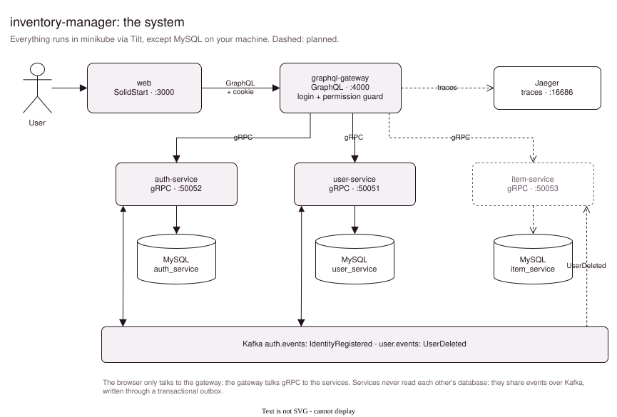

# inventory-manager

Keep track of everything your team owns: what it is, where it is, and who has it.

inventory-manager is a web app on top of a set of small services:
- a SolidStart front-end
- a GraphQL gateway that checks every request's login and permissions
- gRPC services that each own their own data and share changes through Kafka events



## Features

| Feature | Status |
|---|---|
| Accounts: register, email verification, login, sessions that stay logged in | Done |
| Roles and permissions, checked in the gateway and reflected in the UI | Done |
| User management: search, sort, filter, edit and delete users | Done |
| Items: categories, statuses, a searchable items table | In progress: the UI runs on mock data; the [item-service](services/item-service/Readme.md) is being built |
| Locations: buildings, floors and rooms on a floor plan | In progress: the floor-plan view exists |
| Assigning items to people and places, with history | Planned ([roadmap sketch](services/item-service/Readme.md#roadmap)) |

## Components

| Component | What it does | Port |
|---|---|---|
| [web](web/README.md) | The app: SolidStart, TypeScript | `3000` |
| [graphql-gateway](services/graphql-gateway/Readme.md) | The single API for the app: GraphQL, login and permission checks | `4000` |
| [auth-service](services/auth-service/Readme.md) | Logins, email verification, sessions, access tokens, roles | `50052` (gRPC) |
| [user-service](services/user-service/Readme.md) | User profiles | `50051` (gRPC) |
| [item-service](services/item-service/Readme.md) | Items, categories, statuses; later locations and assignments | `50053` (gRPC, planned) |

**Shared building blocks:**
- [shared/](shared): the Go module every service uses: tracing, database setup, Kafka (outbox, consumer), paging, token claims and the roles catalog.
- [proto/](proto): the gRPC contracts and event messages.

## Tech stack

| Layer | Technology |
|---|---|
| Front-end | [SolidStart](https://start.solidjs.com), TypeScript, Zod, Sass, Leaflet |
| API | GraphQL ([gqlgen](https://gqlgen.com)) with schema directives for access control |
| Services | Go, gRPC, [GORM](https://gorm.io) |
| Data | MySQL 8, one database per service |
| Events | Kafka (KRaft) via [franz-go](https://github.com/twmb/franz-go), with a transactional outbox |
| Auth | Ed25519-signed JWTs, rotating refresh tokens in an httpOnly cookie |
| Observability | OpenTelemetry → Jaeger |
| Local platform | Kubernetes (minikube) + [Tilt](https://tilt.dev) |

## Getting started

**Requirements:**
- [Go](https://go.dev) 1.26
- [Bun](https://bun.sh)
- Docker
- [minikube](https://minikube.sigs.k8s.io)
- [Tilt](https://tilt.dev)
- MySQL 8 on your machine, on port 3306

**1. Configure.** Copy the example settings and fill in your MySQL credentials:
```sh
cp .env.example .env
```
`.env` is never committed. [.env.example](.env.example) explains every value, including how to generate the token-signing key.

**2. Start.**
```sh
minikube start --cpus=3
tilt up
```
Tilt compiles the Go services on your machine, builds the images, deploys everything to minikube and forwards the ports. Press space to open the Tilt dashboard.

**3. Open the app:**

| | |
|---|---|
| App | http://localhost:3000 |
| GraphQL playground | http://localhost:4000/graphql |
| Traces (Jaeger) | http://localhost:16686 |
| Kafka UI (start it from the Tilt dashboard) | http://localhost:8080 |

**4. Create your account.**
1. Register at http://localhost:3000/register.
2. Email delivery isn't wired up yet, so the activation link appears in the auth-service logs in Tilt. Open it to verify your account.
3. To get the admin role (for user management), add your email to `ADMIN_EMAILS` in `.env` and restart the auth-service from the Tilt dashboard.

## Repository layout

```
web/                     the front-end
services/
  graphql-gateway/       GraphQL API
  auth-service/          logins, sessions, roles
  user-service/          user profiles
  item-service/          items (in progress)
shared/                  Go module shared by the services
proto/                   gRPC contracts and event messages
infra/development/       Dockerfiles and Kubernetes manifests for Tilt
docs/                    system-wide diagrams
Tiltfile                 the local development setup
.env.example             settings and credentials to copy into .env
```

## How it fits together

- **One way in.** The browser only talks to the gateway. The gateway verifies the access token itself and checks permissions in the schema (`@hasPermission`), so the services can trust what they receive.
- **Each service owns its data.** No service reads another's database. They exchange changes through Kafka events. For example, a registration in the auth-service creates the profile in the user-service.
- **Events don't get lost.** A change and its event are saved in one database transaction (the outbox) and published afterwards. Consumers skip events they have already handled, so an event delivered twice has no double effect.
- **Lists look the same everywhere:** `things(offset, limit, orderBy, filter) { totalCount nodes }`. The services and the web app share helpers for this, so a new table takes little code.

## Diagrams

Each component has a `docs/` folder with a `.drawio` file and an SVG per page; the READMEs show the SVGs. Across components:
- [docs/system.drawio](docs/system.drawio): the overview above
- [docs/auth-workflows.drawio](docs/auth-workflows.drawio): the login flows end to end, from the browser to Kafka

**To edit a diagram:**
1. Open the `.drawio` file in [draw.io](https://app.diagrams.net) or the VS Code extension *Draw.io Integration*.
2. Export the changed page as SVG over the matching file: *File → Export as → SVG*, with *Include a copy of my diagram* on.

Each SVG also contains its own page, so draw.io can open the SVG directly too.
