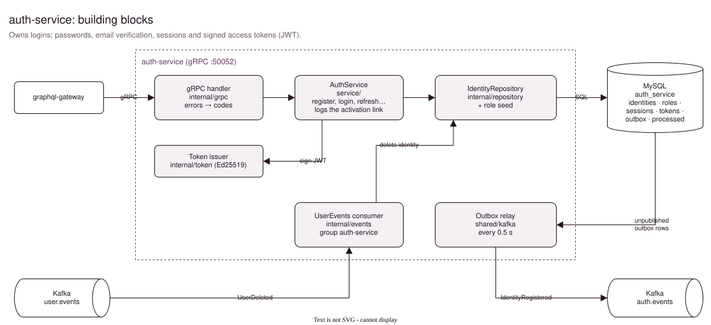
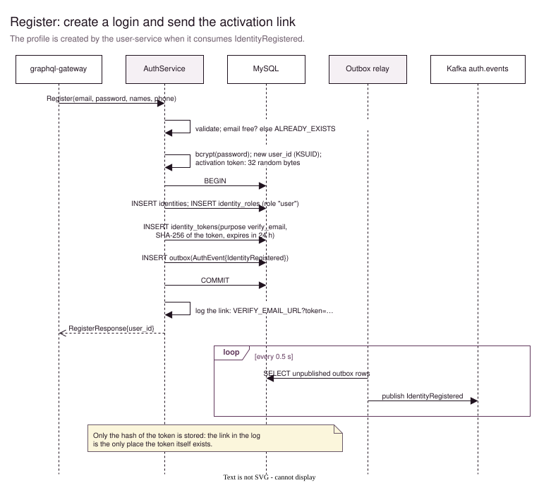
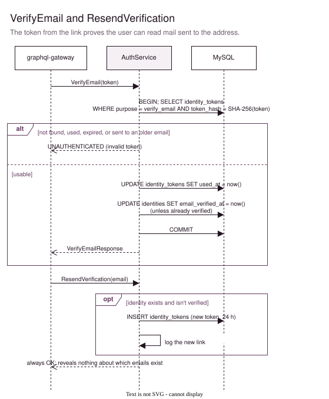
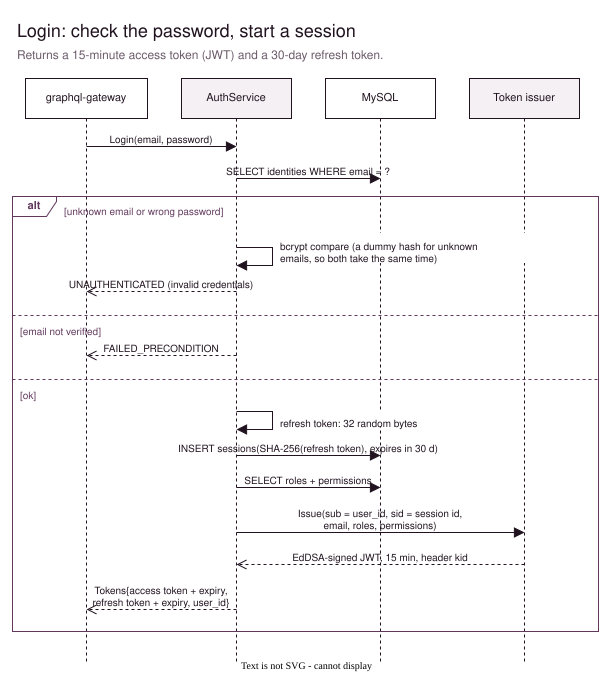
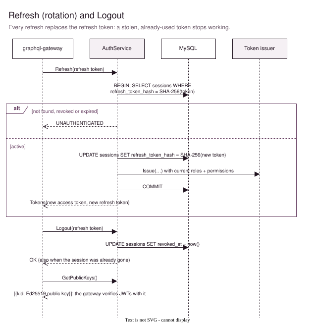
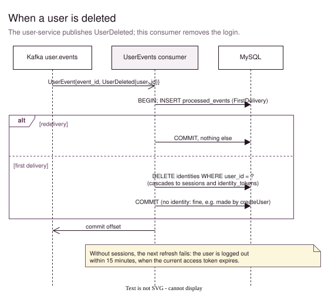
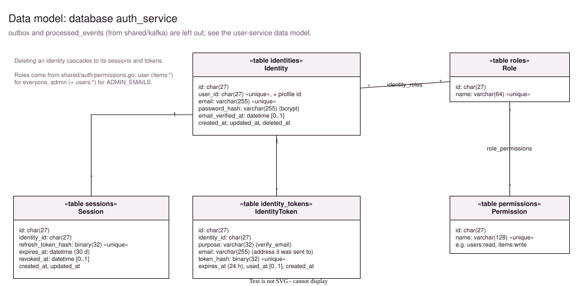

# auth-service

Owns **logins**: email and password, email verification, sessions, and the signed access tokens (JWTs) the gateway checks on every request. It also holds the roles and permissions that go into those tokens.

Profiles (name, phone, avatar) belong to the [user-service](../user-service/Readme.md). Both services use the same user id: this service creates it at registration and announces it with the `IdentityRegistered` event.



The diagrams are pages of [docs/auth-service.drawio](docs/auth-service.drawio). See [Editing the diagrams](#editing-the-diagrams).

## Entry points

There are three ways into the service, all started in [cmd/main.go](cmd/main.go):

| Entry point | What comes in | Code |
|---|---|---|
| gRPC server, `:50052` | `AuthService` calls from the gateway | [internal/grpc](internal/grpc) |
| Kafka consumer, group `auth-service` | `user.events`: `UserDeleted` | [internal/events](internal/events) |
| Outbox relay (background loop) | unpublished rows in the `outbox` table, published to `auth.events` | [shared/kafka](../../shared/kafka/outbox.go) |

At startup, `main.go` does the following, in order:
1. Sets up tracing.
2. Creates the `auth_service` database if it's missing, migrates the tables, and seeds the roles.
3. Loads the signing key.
4. Starts the outbox relay and the Kafka consumer.
5. Serves gRPC, including health checks and reflection.

### gRPC API ([proto/auth/auth.proto](../../proto/auth/auth.proto))

| RPC | Does | Errors |
|---|---|---|
| `Register(email, password, names, phone)` | Creates the login, logs an activation link, publishes `IdentityRegistered` | `INVALID_ARGUMENT`, `ALREADY_EXISTS` |
| `VerifyEmail(token)` | Marks the email as verified | `UNAUTHENTICATED` (invalid token) |
| `ResendVerification(email)` | Logs a new activation link; always OK | |
| `Login(email, password)` | Starts a session: access + refresh token | `UNAUTHENTICATED`, `FAILED_PRECONDITION` (not verified) |
| `Refresh(refresh_token)` | New access token, and replaces the refresh token | `UNAUTHENTICATED` |
| `Logout(refresh_token)` | Ends the session; always OK | |
| `GetPublicKeys()` | The keys to verify access tokens with | |

### Events ([proto/auth/events.proto](../../proto/auth/events.proto))

| Direction | Topic | Event |
|---|---|---|
| publishes | `auth.events` | `IdentityRegistered`: the user-service creates the profile |
| consumes | `user.events` | `UserDeleted`: deletes the login and its sessions |

## Tokens

| | Access token | Refresh token | Activation token |
|---|---|---|---|
| What | JWT signed with Ed25519 (EdDSA) | 32 random bytes | 32 random bytes |
| Lives | 15 minutes | 30 days, replaced on every use | 24 hours, single use |
| Stored here | not at all | only its SHA-256, in `sessions` | only its SHA-256, in `identity_tokens` |
| The client keeps it | in memory (web app) | in an httpOnly cookie (set by the gateway) | in the link |

The access token's claims are:
- `sub`: the user id
- `sid`: the session id
- `email`
- `roles`
- `permissions`

The issuer is `auth-service` and the audience is `inventory-manager`. The token header carries a `kid` (key id), so the gateway knows which public key to check it with.

The gateway verifies access tokens itself, with the keys from `GetPublicKeys`. That's why a normal request never calls this service. The flip side: logging out or deleting a user stops new refreshes right away, but an access token that was already issued keeps working until it expires, at most 15 minutes.

## Workflows

### Register



Everything is saved in one transaction:
- the identity
- its role (`user`)
- the activation token's hash
- the `IdentityRegistered` event, in the outbox

The relay then publishes the event, and the user-service creates the profile.

**Email sending isn't built yet.** The activation link is written to the log instead. In Tilt, open the auth-service logs and click the link there.

### VerifyEmail and ResendVerification



A link can be used once, within 24 hours, and only for the address it was sent to. `ResendVerification` always answers OK, so it can't be used to find out which emails have an account.

### Login



For an unknown email, the password is still checked, against a dummy hash. A wrong email and a wrong password then take equally long, so response times don't reveal which emails exist. Until the email is verified, login fails with `FAILED_PRECONDITION`, and the web app offers to resend the link.

### Refresh and Logout



**Rotation:** every refresh stores a new refresh-token hash on the session, so the old token stops working. Someone who copies a refresh token can only use it until the real owner refreshes.

**Logout** sets `revoked_at` on the session, which makes the next refresh fail.

### When a user is deleted



The consumer deletes the identity for real. Its sessions and tokens are deleted with it, through `ON DELETE CASCADE`. Like the user-service consumer, it records the event id in `processed_events` in the same transaction, so a redelivered event is skipped.

## Data model



## Roles and permissions

The roles, and what each grants, are defined once in [shared/auth/permissions.go](../../shared/auth/permissions.go):

| Role | Who has it | Permissions |
|---|---|---|
| `user` | everyone, from registration | `items:read`, `items:write` |
| `admin` | the emails in `ADMIN_EMAILS` | the above + `users:read`, `users:write` |

At every start, [internal/repository/seed.go](internal/repository/seed.go):
1. Makes the database match that file: it adds missing roles and permissions, and takes away permissions a role no longer lists.
2. Gives `user` to identities without a role.
3. Gives `admin` to the identities whose email is in `ADMIN_EMAILS`. An account registered later only becomes admin after the next restart.

The roles and permissions go into the access token. A change reaches a user at their next token refresh, within 15 minutes. The gateway enforces them with `@hasPermission` and `@hasRole`; see [its README](../graphql-gateway/Readme.md#guards-roles-and-permissions).

## Configuration

| Env var | Default | |
|---|---|---|
| `GRPC_ADDR` | `:50052` | |
| `ADMIN_EMAILS` | unset | Comma-separated; these accounts get the `admin` role. Set in `.env` |
| `DB_HOST`, `DB_PORT` | `localhost`, `3306` | |
| `DB_USER`, `DB_PASSWORD` | `root`, none | Set in `.env` |
| `DB_NAME` | `auth_service` | Created on first start |
| `JWT_PRIVATE_KEY` | unset: a new key per start | Ed25519 key, PKCS#8 PEM on one line with `\n` for the line breaks. Set in `.env`. Without it, a restart makes every access token invalid, and users need to refresh |
| `VERIFY_EMAIL_URL` | `http://localhost:3000/verify-email` | The page the activation link opens; `?token=…` is added |
| `KAFKA_BROKERS` | `127.0.0.1:9094` | In Tilt `kafka:9092` |
| `OTEL_EXPORTER_OTLP_ENDPOINT` | unset: no tracing | In Tilt `http://jaeger:4317` |

To make a signing key that survives restarts:

```sh
openssl genpkey -algorithm ed25519 | awk 'NF {printf "%s\\n", $0}'   # put the output in JWT_PRIVATE_KEY in .env
```

## Running

```sh
make run     # gRPC on :50052
make proto   # after changing proto/auth/*.proto or proto/user/events.proto
make         # list all targets
```

## Layout

```
cmd/main.go            wiring: tracing, database + seed, signing key, Kafka, gRPC
service/               AuthService: register, verify, login, refresh, logout
internal/
  domain/              interfaces, errors, Tokens
  grpc/                gRPC handler, error → status
  repository/          GORM queries for identities, tokens, sessions; role seed
  token/               JWT issuing with Ed25519
  events/              Kafka consumer for user.events
  models/              Identity, IdentityToken, Session, Role, Permission
pkg/pb/                protoc output, never edit
docs/                  auth-service.drawio + one SVG per page
```

See also [docs/auth-workflows.drawio](../../docs/auth-workflows.drawio): the full login flow across all services, including the web app.

## Editing the diagrams

Open [docs/auth-service.drawio](docs/auth-service.drawio) in [draw.io](https://app.diagrams.net) or the VS Code extension *Draw.io Integration*. After a change, export each page as SVG over the matching file in `docs/`: *File → Export as → SVG*, with *Include a copy of my diagram* on.
