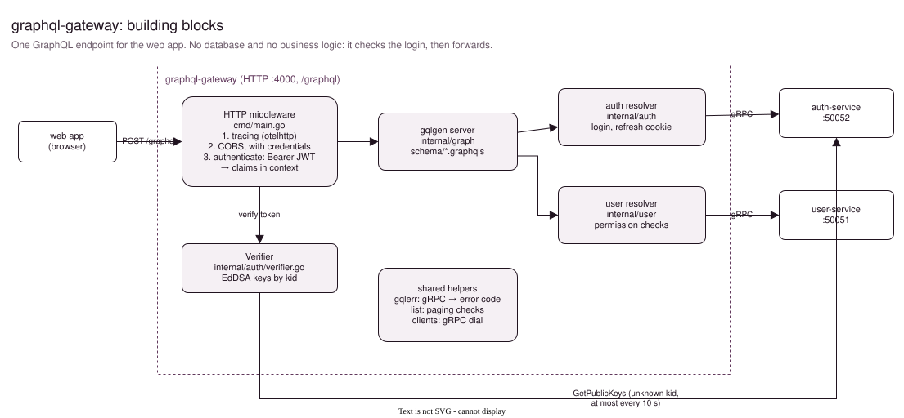
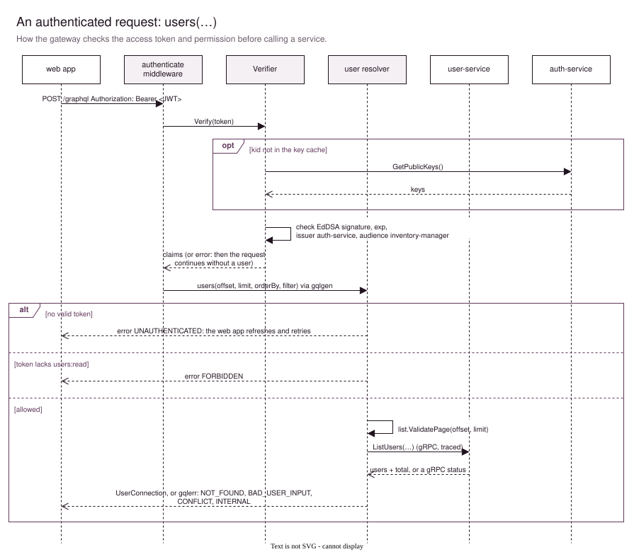
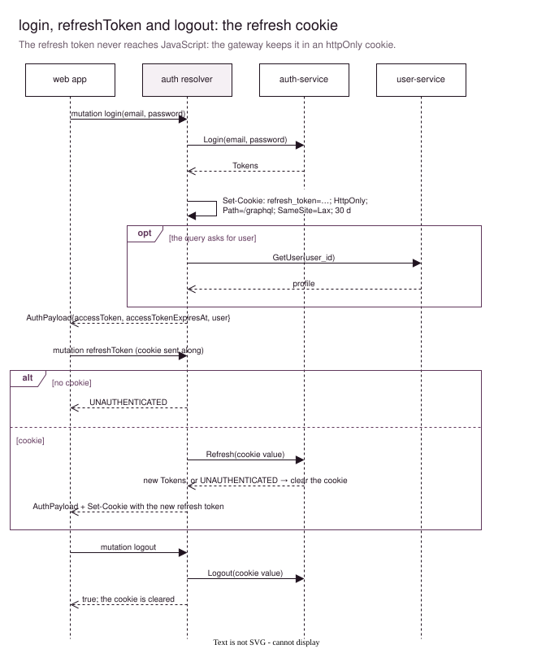

# graphql-gateway

The **single entry point for the web app**: one GraphQL endpoint in front of the gRPC services. For each request it:
1. checks the access token
2. checks the permission
3. validates the input
4. calls the right service and maps its types and errors to GraphQL

It has no database and no business logic of its own.



The diagrams are pages of [docs/graphql-gateway.drawio](docs/graphql-gateway.drawio). See [Editing the diagrams](#editing-the-diagrams).

## Entry points

The HTTP server on `:4000`, set up in [cmd/main.go](cmd/main.go):

| Route | |
|---|---|
| `POST /graphql` | GraphQL queries and mutations |
| `GET /graphql` | The playground (GraphiQL) for trying queries in the browser |
| `GET /` | Redirects to `/graphql` |
| `GET /healthz` | Health check for Kubernetes |

Every request goes through three middlewares, outermost first:
1. **Tracing** (otelhttp): one span per request. The trace continues into the services over gRPC.
2. **CORS**: only the origins in `ALLOWED_ORIGINS` may call, *with credentials*, so the browser sends and accepts the refresh cookie.
3. **Authenticate**: verifies `Authorization: Bearer <token>` and puts the claims in the request context. A missing, invalid or expired token isn't an error here. The request just continues without a user, and whatever needs one answers `UNAUTHENTICATED`.

### Guards: roles and permissions

Fields are protected in the schema with directives, which run before the resolver:

```graphql
me: User @authenticated                                   # any login
users(...): UserConnection! @hasPermission(permission: "users:read")
somethingForAdmins: Thing @hasRole(roles: ["admin"])      # one of the roles
```

| Problem | `extensions.code` | HTTP status |
|---|---|---|
| no valid access token | `UNAUTHENTICATED` | 200 |
| the token lacks the permission or role | `FORBIDDEN` | **403** |

[internal/gqlerr/http.go](internal/gqlerr/http.go) sets the 403: a response with any `FORBIDDEN` error gets that status. The directives are in [internal/auth/directives.go](internal/auth/directives.go). In Go code, `auth.RequirePermission(ctx, …)` and `auth.RequireRole(ctx, …)` do the same checks. Prefer permissions over roles: a role is only a named set of permissions. The catalog is [shared/auth/permissions.go](../../shared/auth/permissions.go).

`login` and `refreshToken` also return the token's `roles` and `permissions`, so the web app can hide what the user may not do.

### GraphQL API ([schema/](schema))

| Operation | Needs | Calls |
|---|---|---|
| `me` | login | user-service `GetUser(sub)` |
| `user(id)`, `users(offset, limit, orderBy, filter)` | `users:read` | user-service `GetUser`, `ListUsers` |
| `createUser`, `updateUser`, `deleteUser` | `users:write` | user-service |
| `register`, `verifyEmail`, `resendVerification` | nothing | auth-service |
| `login`, `refreshToken`, `logout` | nothing; they use the refresh cookie | auth-service |

Lists follow one convention: `things(offset, limit, orderBy, filter): ThingConnection!` with `totalCount` and `nodes`.

Errors carry `extensions.code`, translated from the service's gRPC status by [internal/gqlerr](internal/gqlerr):

| Code | From | Meaning |
|---|---|---|
| `UNAUTHENTICATED` | no valid token, or gRPC `UNAUTHENTICATED` | Log in or refresh |
| `FORBIDDEN` | the token lacks the permission or role | HTTP 403 |
| `BAD_USER_INPUT` | gRPC `INVALID_ARGUMENT` | `extensions.fields` has a message per field |
| `NOT_FOUND`, `CONFLICT`, `FAILED_PRECONDITION` | the same gRPC codes (`ALREADY_EXISTS` → `CONFLICT`) | |
| `INTERNAL` | anything else | The cause is logged, not sent to the client |

## Workflows

### An authenticated request



The gateway checks access tokens itself, with no call to the auth-service per request:
- The `Verifier` keeps the auth-service's public keys in memory, keyed by `kid`.
- When a token arrives with a `kid` it doesn't know, it fetches the keys again with `GetPublicKeys`. That happens at most every 10 s, so bad tokens can't flood the auth-service.
- A token only counts if all of these hold:
  - the EdDSA signature is valid
  - it hasn't expired
  - the issuer is `auth-service`
  - the audience is `inventory-manager`

Each resolver then checks the permission it needs, for example `users:read`, before calling a service.

### login, refreshToken and logout



The refresh token is set as a cookie and never shows up in a GraphQL response:
- `HttpOnly`: JavaScript can't read it.
- `Path=/graphql`: only sent to this endpoint.
- `SameSite=Lax`: not sent along with requests started from other sites.
- Expires with the session, after 30 days.

`refreshToken` reads the cookie and asks the auth-service for new tokens. The response replaces the cookie with the new refresh token. When the session is over, the gateway clears the cookie, so the browser stops sending a dead token. `AuthPayload.user` is fetched from the user-service only when the query asks for it.

## Configuration

| Env var | Default |
|---|---|
| `HTTP_ADDR` | `:4000` |
| `USER_SERVICE_ADDR` | `localhost:50051` (`host:port`, no scheme) |
| `AUTH_SERVICE_ADDR` | `localhost:50052` |
| `ALLOWED_ORIGINS` | `http://localhost:3000`: origins (comma-separated) allowed to call with cookies |
| `COOKIE_SECURE` | `false`: set `true` behind HTTPS, so the refresh cookie is only sent over HTTPS |
| `OTEL_EXPORTER_OTLP_ENDPOINT` | unset: no tracing. In Tilt it's `http://jaeger:4317`, see the Jaeger UI at http://localhost:16686 |

## Running

Run `make` to list the targets. `make run` starts it on `:4000`, with the playground at http://localhost:4000/graphql. Tokens go in the playground's *Headers* tab as `{"Authorization": "Bearer …"}`.

```sh
make graphql   # after changing schema/*.graphqls
make proto     # after changing proto/*
```

## Layout

```
cmd/main.go                  wiring: one gRPC connection + resolver per service, routes, shutdown
schema/                      the GraphQL schema, one .graphqls per service
internal/
  user/                      everything user: resolver.go (calls user-service), mapper.go
  auth/                      logins: token verification middleware, refresh cookie, auth mutations
  gqlerr/                    shared: error codes, gRPC status → GraphQL error
  list/                      shared: paging validation, sort direction
  clients/                   shared: gRPC dialing and call logging
  graph/                     gqlgen glue: Resolver, server, one-line <service>.resolvers.go
    generated/               gqlgen output, one file per schema file, never edit
    model/                   gqlgen output, never edit
pkg/pb/<service>/            protoc output, never edit
docs/                        graphql-gateway.drawio + one SVG per page
```

## Adding a service

Using an `item` service as the example:

1. **Proto:** in the [Makefile](Makefile), add `ITEM_PB := item/item.proto=$(MODULE)/pkg/pb/item;itempb`, add its `--go_opt` and `--go-grpc_opt` flags and `item/item.proto` to `proto`, then `make proto`.
2. **Schema:** write `schema/item.graphqls`, using `extend type Query` / `extend type Mutation`. Run `make graphql`. This creates `internal/graph/item.resolvers.go` with stubs.
3. **Package:** add `internal/item/` like `internal/user/`: a `Resolver` around the gRPC client, plus `mapper.go`. Lists use `list.ValidatePage` and `list.SortDirection`. Return gRPC errors unchanged, because `gqlerr` maps them.
4. **Wire it:** add `ItemResolver *item.Resolver` to [internal/graph/resolver.go](internal/graph/resolver.go), make each stub in `item.resolvers.go` a one-line call into it, and dial it in [cmd/main.go](cmd/main.go) with an `ITEM_SERVICE_ADDR` env var.
5. **Deploy:** add `ITEM_SERVICE_ADDR` to the [deployment](../../infra/development/k8s/graphql-gateway-deployment.yaml), and the service to `resource_deps` in the [Tiltfile](../../Tiltfile).

## Editing the diagrams

Open [docs/graphql-gateway.drawio](docs/graphql-gateway.drawio) in [draw.io](https://app.diagrams.net) or the VS Code extension *Draw.io Integration*. After a change, export each page as SVG over the matching file in `docs/`: *File → Export as → SVG*, with *Include a copy of my diagram* on.
