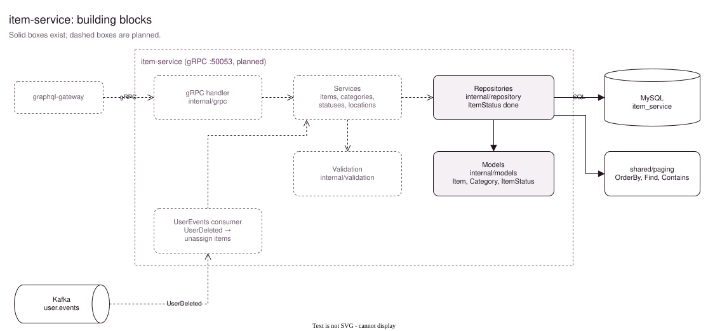
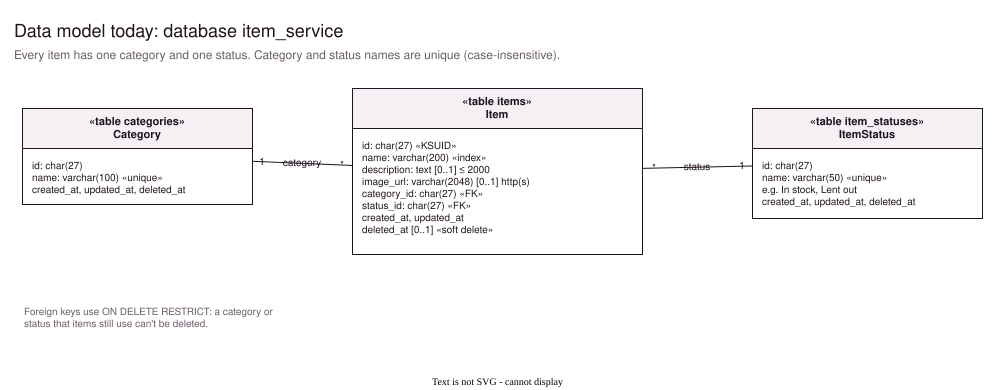
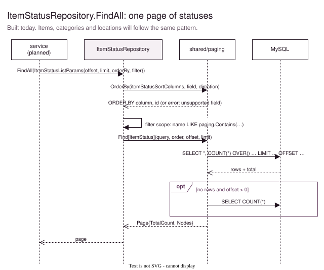

# item-service

> **Work in progress.** So far there are the models, the domain interfaces and the item-status repository. The gRPC API, the services, validation, `main.go` and the Tilt setup still need to be built. Until then, the web app's items page (Home) uses mock data from [web/src/api/items.ts](../../web/src/api/items.ts).

Will own the **inventory**: the items, the categories they belong to, and the statuses they can be in (for example *In stock* or *Lent out*). It's built the same way as the [user-service](../user-service/Readme.md), so that's the reference for every missing part.



Solid boxes exist; dashed ones are still to build. The diagrams are pages of [docs/item-service.drawio](docs/item-service.drawio).

## Entry points (planned)

| Entry point | Will take | Built like |
|---|---|---|
| gRPC server, `:50053` | `ItemService` calls from the gateway | [user-service internal/grpc](../user-service/internal/grpc) |
| `cmd/main.go` | tracing, database (`item_service`), gRPC server | [user-service cmd/main.go](../user-service/cmd/main.go) |

The gRPC contract will be `proto/item/item.proto`, with the same paging convention as `ListUsers`. Kafka is only needed once another service has to react to item changes. Then the outbox from `shared/kafka` works here unchanged.

## Data model



The models are in [internal/models](internal/models):
- `gorm` tags define the tables, indexes and foreign keys.
- `mod` tags clean the input up.
- `validate` tags check it.
- `json` tags name the fields in error messages.

The `Category` and `Status` fields on `Item` carry `validate:"-"`. Creating an item then only needs `categoryId` and `statusId`, not the whole category.

Category and status names are unique and compared without case, so *Tools* and *tools* count as the same name. Like the users' emails, the unique index includes soft-deleted rows.

## Workflow: one page of item statuses



[ItemStatusRepository.FindAll](internal/repository/item_status_repository.go) uses [shared/paging](../../shared/paging/paging.go):
- `paging.OrderBy` turns the sort field into a column, using an allow-list, with `id` as the last sort key.
- `paging.Find` loads the page and the total in one query.
- `paging.Contains` builds the `LIKE` pattern.

Items and categories will use the same three helpers. Only the sortable columns and the filter function differ per entity.

## To do

1. `internal/validation`: copy it from the user-service.
2. Repositories for items and categories. Change `ItemRepository.FindAll` to return `*types.Page[*models.Item]`, the type `paging.Find` gives.
3. Services in `service/`, implementing the interfaces in [internal/domain](internal/domain). Their `FindAll` methods still take only a filter; give them the list params, like the repositories have.
4. `proto/item/item.proto`, the gRPC handler and `cmd/main.go`.
5. A Dockerfile, a k8s deployment and a Tilt resource, then [add it to the gateway](../graphql-gateway/Readme.md#adding-a-service).
6. Point the web app's `api/items.ts` at the real API. Its function signatures already match.

## Layout

```
internal/
  domain/              interfaces for the services and repositories, errors
  models/              Item, Category, ItemStatus (GORM + mod/validate tags)
  repository/          ItemStatusRepository (done)
  grpc/, events/, validation/   empty for now
pkg/types/             list params, filters, sort fields, input
docs/                  item-service.drawio + one SVG per page
```

## Editing the diagrams

Open [docs/item-service.drawio](docs/item-service.drawio) in [draw.io](https://app.diagrams.net) or the VS Code extension *Draw.io Integration*. After a change, export each page as SVG over the matching file in `docs/`: *File → Export as → SVG*, with *Include a copy of my diagram* on.
