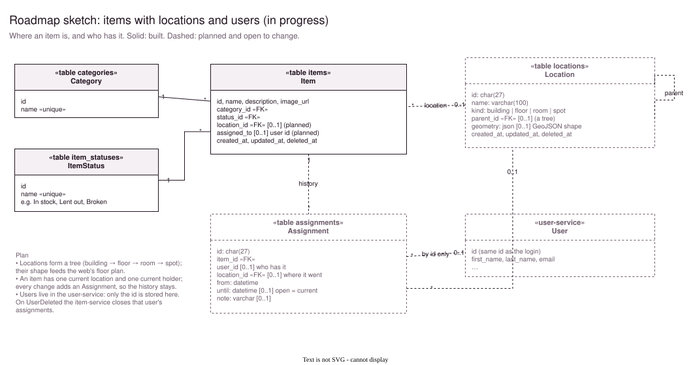
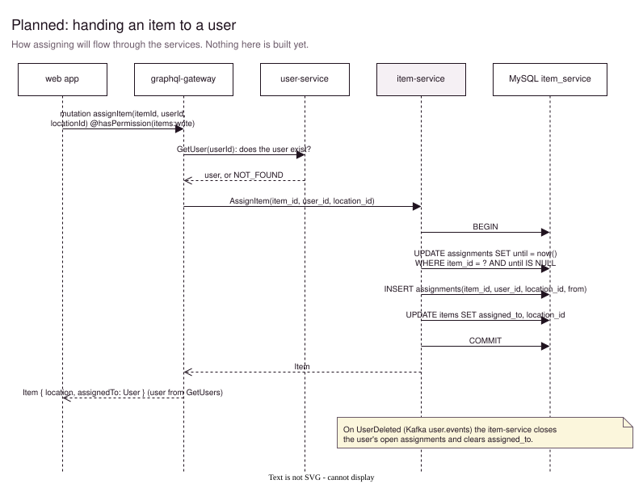

# item-service

Owns the **inventory**: the devices and equipment a team owns. Each item has a **category**, the kind of device (for example *Computers*, *IoT* or *Networking*), and a **status**, its condition (for example *Working*, *Damaged* or *In repair*). It serves them over gRPC to the [graphql-gateway](../graphql-gateway/Readme.md).

| | |
|---|---|
| **API** | gRPC on `:50053`: `item.ItemService`, `item.CategoryService` and `item.ItemStatusService`, defined in [proto/item/item.proto](../../proto/item/item.proto) |
| **Database** | MySQL `item_service`, created on first start |
| **Events** | none yet; `UserDeleted` is planned for assignments |


## API

| RPC | Description |
|---|---|
| `GetItem(id)` | One item with its category and status |
| `ListItems(offset, limit, order_by, sort_direction, filter)` | One page of items with their category and status, plus the total. Sorts by `name`, `created_at`, `updated_at` (also `category_id`, `status_id`). Filters: `search` (name or description), `name`, `category_id`, `status_id`. |
| `CreateItem(item)`, `UpdateItem(id, item)` | The category and status must exist. Update replaces every field; leaving out `description` or `image_url` clears it. |
| `DeleteItem(id)` | Soft delete |
| `ListCategories`, `CreateCategory(name)`, `UpdateCategory(id, name)`, `DeleteCategory(id)` | Categories: a unique name each, ignoring case |
| `ListItemStatuses`, `CreateItemStatus(name)`, `UpdateItemStatus(id, name)`, `DeleteItemStatus(id)` | Statuses: the same |

**Errors** are gRPC status codes, from the error kinds in [shared/errs](../../shared/errs):

| Code | When |
|---|---|
| `INVALID_ARGUMENT` | Invalid input, with a message per field. Also for an item whose category or status doesn't exist (`categoryId`, `statusId`). |
| `NOT_FOUND` | No such item, category or status |
| `ALREADY_EXISTS` | A category or status name that's taken |
| `FAILED_PRECONDITION` | Deleting a category or status that items still have |

Try it with [grpcurl](https://github.com/fullstorydev/grpcurl):
```sh
grpcurl -plaintext -d '{"limit": 5, "orderBy": "name"}' localhost:50053 item.ItemService/ListItems
```

## How it works

```
gRPC handlers (internal/grpc)     proto ⇄ types; errors → status codes (errs.ToStatus)
  → services (service/)           validation, checks that references exist, related records
    → repositories (internal/repository)   GORM queries, paging, delete protection
```

- **One query per read:** items are read with their category and status joined in (`Joins("Category")`). [shared/paging](../../shared/paging/paging.go) loads a page and its total in that same query, so listing items is one SQL statement, and so is getting one. Only a page past the end needs a separate `COUNT`.
- **References:** before saving an item, the service checks that its category and status exist and reports a missing one on its field. The foreign keys are the last line of defence.
- **Deleting a category or status** is refused while items still have it. Rows are soft-deleted, which is an `UPDATE`, so the foreign key's `ON DELETE RESTRICT` can't guard this. The repository checks it in the same transaction.
- **Names** of categories and statuses are unique and compared without case, so *IoT* and *iot* are the same. Like users' emails, a soft-deleted name stays taken.

## Data model


## Roadmap



Next is tying items to people and places. Dashed boxes are planned and may still change.

- **Locations form a tree:** building → floor → room → spot. A location can carry a GeoJSON shape, which feeds the floor plan in the web app.
- **An item has one current location and one current holder.** Every change adds an `Assignment` row, so the history of who had what, and where, is kept.
- **Users stay in the user-service.** The item-service stores only their id. When a user is deleted (`UserDeleted`, via `a.Consume` + `kafka.HandleOnce`), their open assignments are closed.



## Listing, step by step


## Configuration

| Variable | Default | Notes |
|---|---|---|
| `GRPC_ADDR` | `:50053` | |
| `DB_HOST`, `DB_PORT` | `localhost`, `3306` | In the cluster: from `app-config` |
| `DB_USER`, `DB_PASSWORD` | `root`, none | From `.env` |
| `DB_NAME` | `item_service` | |
| `OTEL_EXPORTER_OTLP_ENDPOINT` | unset (no tracing) | In the cluster: `http://jaeger:4317` |

## Development

```sh
make run     # start the gRPC server on :50053 (reads ../../.env)
make test    # repository tests use MySQL (an item_service_test database) and skip without it
make proto   # regenerate pkg/pb after changing proto/item/item.proto
```

## Project structure

```
cmd/main.go            startup via shared/app: database, gRPC server
service/               ItemService, CategoryService, ItemStatusService
internal/
  domain/              service and repository interfaces, errors
  grpc/                gRPC handlers and proto ⇄ types mapping
  repository/          GORM queries for items, categories, statuses
  models/              Item, Category, ItemStatus (database.Model + validation tags)
pkg/types/             list params, filters, sort fields, input
pkg/pb/                generated from proto/, don't edit
docs/                  item-service.drawio and its SVGs
```
