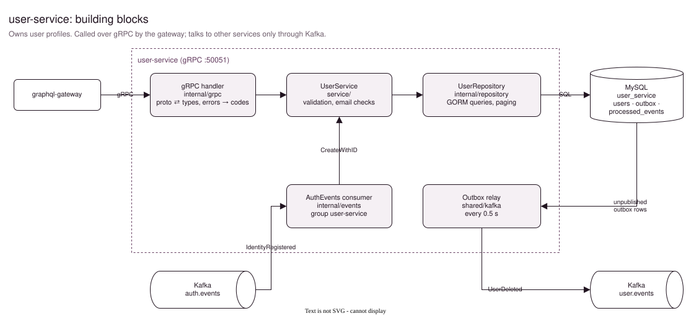
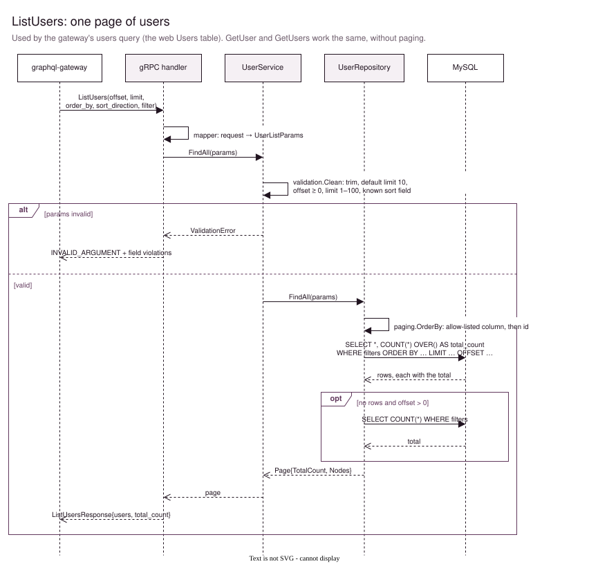
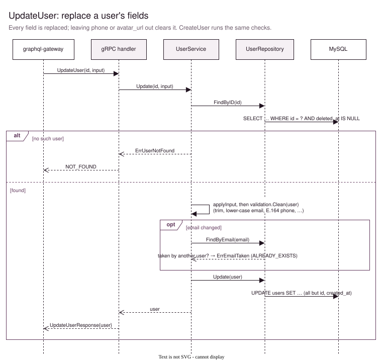
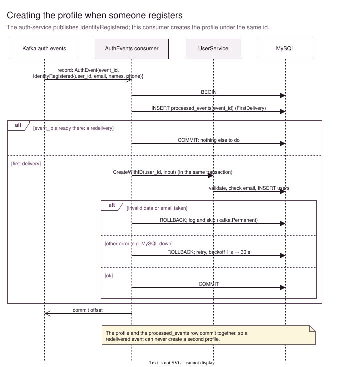
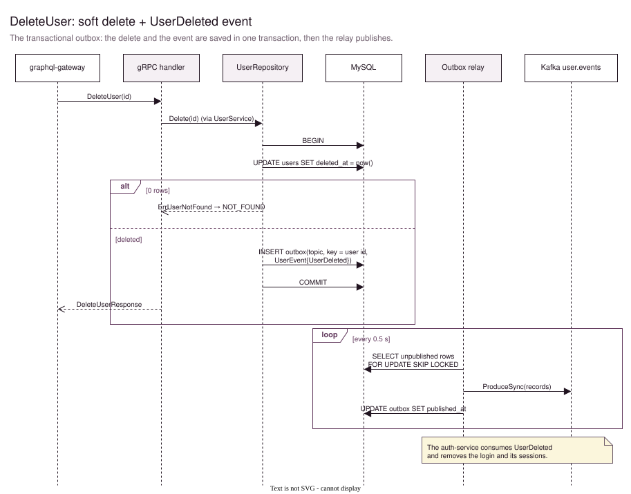
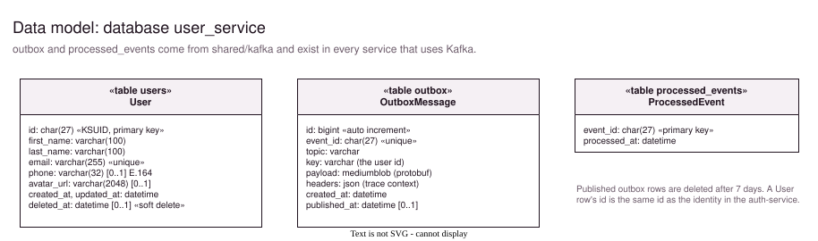

# user-service

Owns **user profiles**: name, email, phone and avatar. It serves them over gRPC to the [graphql-gateway](../graphql-gateway/Readme.md), and stays in step with the [auth-service](../auth-service/Readme.md) through Kafka events.

| | |
|---|---|
| **API** | gRPC `user.UserService` on `:50051`, defined in [proto/user/user.proto](../../proto/user/user.proto) |
| **Database** | MySQL `user_service` |
| **Consumes** | `auth.events`: `IdentityRegistered` |
| **Publishes** | `user.events`: `UserDeleted` |

Passwords and logins live in the auth-service, not here. A profile and its login share one id: the auth-service creates it at registration, and this service creates the profile under that id.



## API

| RPC | Description |
|---|---|
| `GetUser(id)` | One user; `NOT_FOUND` when missing or deleted |
| `GetUsers(ids)` | Several users in one call; unknown ids are skipped |
| `ListUsers(offset, limit, order_by, sort_direction, filter)` | One page of users plus the total count |
| `CreateUser(input)` | A profile without a login, for admins |
| `UpdateUser(id, input)` | Replaces all editable fields; leaving `phone` or `avatar_url` out clears it |
| `DeleteUser(id)` | Soft-deletes the user and publishes `UserDeleted` |

**Errors** are gRPC status codes:

| Code | When |
|---|---|
| `INVALID_ARGUMENT` | Invalid input. A `BadRequest` detail has one message per field. |
| `NOT_FOUND` | No such user. |
| `ALREADY_EXISTS` | The email is taken. |
| `INTERNAL` | Anything else. The cause is logged, not returned. |

Try it with [grpcurl](https://github.com/fullstorydev/grpcurl); reflection is on:
```sh
grpcurl -plaintext -d '{"limit": 5}' localhost:50051 user.UserService/ListUsers
```

## Events

Defined in [proto/user/events.proto](../../proto/user/events.proto) and [proto/auth/events.proto](../../proto/auth/events.proto):

| | Topic | Event | Effect |
|---|---|---|---|
| Consumes | `auth.events` | `IdentityRegistered` | Creates the profile under the registered user's id |
| Publishes | `user.events` | `UserDeleted` | The auth-service deletes the login and its sessions |

Records are keyed by user id, so the events for one user stay in order.

**Delivery guarantees:**
- **Publishing:** events are written through a transactional outbox, so a change and its event are saved together.
- **Consuming:** the consumer is idempotent, so an event delivered twice has no double effect.

## Workflows

### Listing users



1. **Validate:**
   - offset ≥ 0
   - limit 1–100, default 10
   - a known sort field
2. **Order:** [shared/paging](../../shared/paging/paging.go) maps the sort field to a column through an allow-list. It always adds `id` last, so pages stay stable when values are equal.
3. **Query:** one query returns the page and the total: `COUNT(*) OVER()`. Only a page past the end needs a separate `COUNT`.

Filters match substrings and ignore case. A `%` or `_` in the input is matched literally.

### Updating a user



The new values are cleaned up and validated like on create. When the email changes, it must not belong to another user. The unique index on `email` guards against two requests at the same moment.

### Creating a profile on registration



In one transaction, the consumer:
1. records the event id in `processed_events`
2. creates the profile

A redelivered event finds its id already recorded and is skipped.

When creating the profile fails:
- **The data can't work** (invalid fields, or the email is taken): the event is logged and skipped.
- **Anything else:** it's retried with a backoff from 1 s up to 30 s.

### Deleting a user



The soft delete and the `UserDeleted` event are saved in one transaction. The outbox relay publishes the event within about half a second, or once Kafka is reachable again. Published outbox rows are cleaned up after 7 days.

## Data model



IDs are [KSUIDs](https://github.com/segmentio/ksuid): 27 characters that sort by creation time.

Deleted users are soft-deleted (`deleted_at`) and keep their email in the unique index. That email can't be registered again yet.

## Configuration

| Variable | Default | Notes |
|---|---|---|
| `GRPC_ADDR` | `:50051` | |
| `DB_HOST`, `DB_PORT` | `localhost`, `3306` | |
| `DB_USER`, `DB_PASSWORD` | `root`, none | From `.env` |
| `DB_NAME` | `user_service` | |
| `KAFKA_BROKERS` | `127.0.0.1:9094` | Comma-separated. In the cluster: `kafka:9092` |
| `OTEL_EXPORTER_OTLP_ENDPOINT` | unset (no tracing) | In the cluster: `http://jaeger:4317` |

## Development

Tilt runs the service with everything else (see the [root README](../../Readme.md#getting-started)). To run it on its own, with MySQL and Kafka reachable:

```sh
make run     # start the gRPC server on :50051 (reads ../../.env)
make test    # run the tests; repository tests use MySQL and skip without it
make proto   # regenerate pkg/pb after changing the .proto files
make         # list all targets
```

## Project structure

```
cmd/main.go            startup: tracing, database, Kafka, gRPC server
service/               UserService: business rules
internal/
  domain/              interfaces and errors shared by the packages
  grpc/                gRPC handler: proto ⇄ types, errors → status codes
  repository/          GORM queries; Delete also writes the outbox
  events/              Kafka consumer for auth.events
  models/              GORM models with validation tags
  validation/          applies the `mod` (clean-up) and `validate` tags
pkg/types/             request types: list params, filters, input
pkg/pb/                generated from proto/, don't edit
docs/                  user-service.drawio and its SVGs
```
