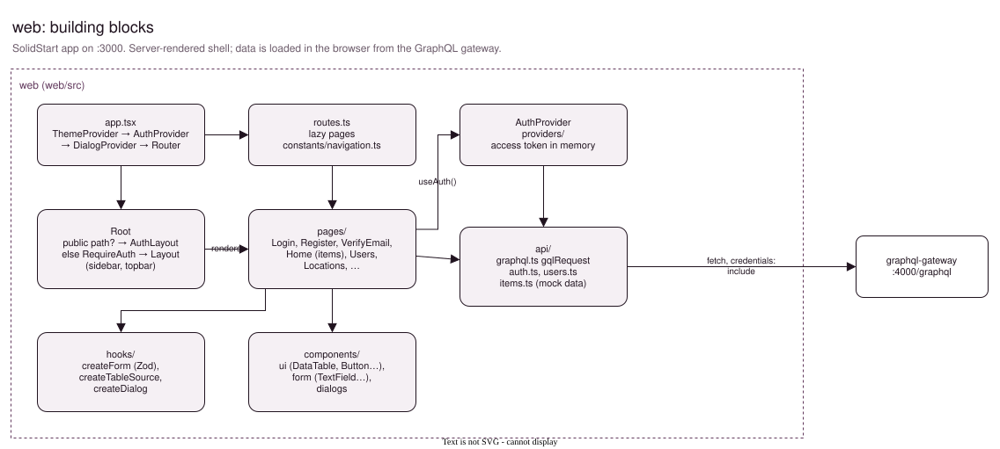
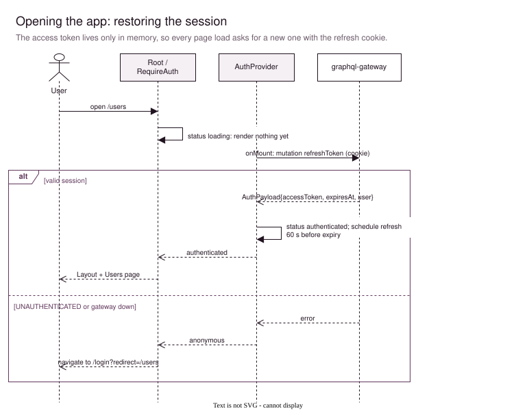
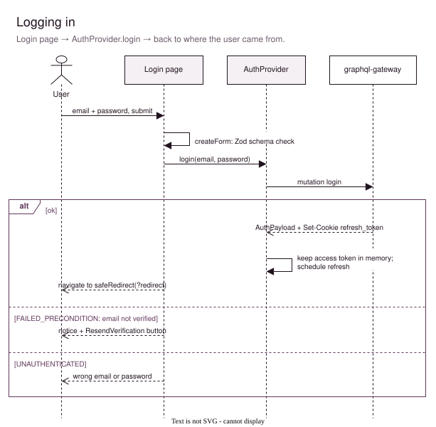
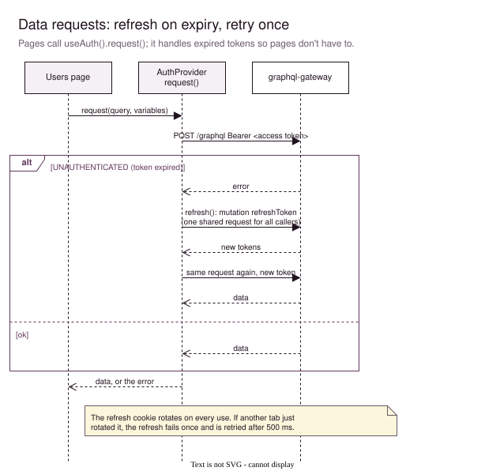
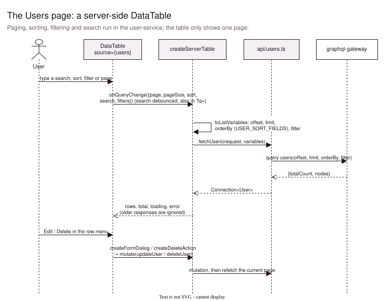

# web

The **front-end**: a [SolidStart](https://start.solidjs.com) app on http://localhost:3000. You log in, manage the inventory and the users, and see locations on a floor plan. The server renders the page shell; all data is loaded in the browser from the [GraphQL gateway](../services/graphql-gateway/Readme.md). It's the only part of the system a user talks to directly.



The diagrams are pages of [docs/web.drawio](docs/web.drawio). See [Editing the diagrams](#editing-the-diagrams).

## Entry points

| File | Role |
|---|---|
| [src/entry-client.tsx](src/entry-client.tsx), [src/entry-server.tsx](src/entry-server.tsx) | SolidStart's start points in the browser and on the server |
| [src/app.tsx](src/app.tsx) | The providers (theme, auth, dialogs), the router, and `Root`, which picks the page frame |
| [src/routes.ts](src/routes.ts) | URL → page, loaded lazily |
| [src/constants/navigation.ts](src/constants/navigation.ts) | The sidebar; breadcrumbs and page titles come from it too |

`Root` picks one of two frames, based on the URL:
- **Public pages** (`/login`, `/register`, `/verify-email`; see `PUBLIC_PATHS`) get the plain `AuthLayout`.
- **Everything else** is wrapped in `RequireAuth`, which only renders it when logged in, and gets the `Layout` with the sidebar and topbar.

### Pages

| Path | Page | Data |
|---|---|---|
| `/login`, `/register`, `/verify-email` | Login, Register, VerifyEmail | auth mutations |
| `/` | Home: all items, a server-side table | mock data in [api/items.ts](src/api/items.ts) until the item-service exists |
| `/users` | Users table: search, sort, filter, edit, delete | `users` query, `updateUser`, `deleteUser` |
| `/locations` | Floor plan with GeoJSON (Leaflet) | [data/floorPlan.json](src/data/floorPlan.json) |
| `/categories`, `/reports`, `/settings/*` | Coming soon | |

## Workflows

### Opening the app



The access token is kept only in memory, never in `localStorage`, so a script injected into the page can't read it from storage. That means every page load starts without one. `AuthProvider` asks for a new access token right away, using the refresh cookie the browser holds. Until that answer comes back, the status is `loading` and protected pages render nothing. The server can't see the session at all, so it always renders the logged-out state.

### Logging in



The form is checked with Zod in the browser first; the services check everything again. After logging in, you go back to the page you came from (`?redirect=`), but only to a path on this site (`safeRedirect`). An unverified account gets a button to resend the activation link.

### Data requests and refreshing



Pages fetch data with `useAuth().request(query, variables)`. It refreshes the access token in two cases:
- **On a schedule**, 60 seconds before the token expires.
- **When a request comes back `UNAUTHENTICATED`.** Then it refreshes and retries the request once.

Refreshes are *single-flight*: callers at the same moment share one refresh request. That matters because the refresh cookie is replaced on every use, so two refreshes at once would make one fail. The same can happen between two tabs, so a refresh that fails while you're logged in is retried once after 500 ms.

### The Users table



`DataTable` doesn't search or sort itself. It reports what it needs, and [createServerTable](src/hooks/createServerTable.ts) turns that into the list query's variables ([api/list.ts](src/api/list.ts)) and fetches exactly that page. Two more details:
- **Ignored responses:** a response that arrives after a newer request is ignored, so a slow old page can't replace a newer one.
- **Changes refetch:** edits and deletes go through `mutate()`, which shows the loading state and refetches the current page afterwards.

### Adding a table

Every list in the gateway has the same shape, `things(offset, limit, orderBy, filter) { totalCount nodes }`, so a new table needs only four pieces:

1. **API** (`src/api/things.ts`): the type, a `fetchThings(request, variables: ListVariables)` with the GraphQL query, and a sort map from column id to the API's sort field:
   ```ts
   export const THING_SORT_FIELDS = { name: "NAME", createdAt: "CREATED_AT" };
   ```
2. **Columns:** a `DataTableColumn<Thing>[]`, with column ids that match the API's filter fields.
3. **Data:**
   ```ts
   const things = createServerTable({
     fetch: (variables) => api.fetchThings(auth.request, variables),
     sortFields: api.THING_SORT_FIELDS,
   });
   ```
4. **Table:** `<DataTable source={things} columns={THING_COLUMNS} rowKey={(t) => t.id} />`, with `things.summary("thing", "things")` as the page header's description.

What comes with it:
- **Search** lives in the URL (`?q=`), so it survives a reload and the topbar search box can fill it.
- **Load errors** show in the table, with a "Try again" button.

For deleting with a confirmation, use `createDeleteAction({ source: things, noun: ["thing", "things"], name, remove })`, and pass its `run` to `onDelete` or a row action. Editing works the same way through `createFormDialog` ([features/users/hooks/createUserEditor.tsx](src/features/users/hooks/createUserEditor.tsx) is an example).

## Code layout

```
src/
  app.tsx, routes.ts     providers, router, page frames
  api/                   one module per area: GraphQL operations + their types
    graphql.ts           gqlRequest: fetch with cookies, error codes (GraphQLRequestError)
  providers/             AuthProvider, ThemeProvider, DialogProvider
  context/               the contexts + useAuth(), useTheme(), …
  pages/                 one component per route (+ its .scss)
  features/              bigger parts with their own components: auth/, layout/
  components/            reusable UI: ui/ (DataTable, Button, …), form/, dialogs/
  hooks/                 createForm (Zod), createTableSource, createDialog, createMediaQuery
  constants/             navigation, API URL, theme
docs/                    web.drawio + one SVG per page
```

**Adding a page:**
1. Create `src/pages/Thing.tsx`.
2. Add it to [routes.ts](src/routes.ts).
3. Add it to [navigation.ts](src/constants/navigation.ts) if it belongs in the sidebar.
4. For data, add `src/api/things.ts` with functions that take `request` from `useAuth()`. See [api/users.ts](src/api/users.ts).

## Configuration

| Env var | Default |
|---|---|
| `VITE_GRAPHQL_URL` | `http://localhost:4000/graphql` |

The gateway only accepts calls with cookies from the origins in its `ALLOWED_ORIGINS`, which is `http://localhost:3000` by default. When the app runs on another address, add it there.

## Running

Tilt runs it in the cluster with live updates: changes in `src/` show up without a rebuild. To run it on your machine instead:

```sh
bun install
bun run dev      # http://localhost:3000
bun run build    # production build into .output; run it with bun run start
```

To log in, register an account at `/register` and click the activation link in the auth-service's log. For the admin pages (like Users), add your email to `ADMIN_EMAILS` in `.env` and restart the auth-service.

## Editing the diagrams

Open [docs/web.drawio](docs/web.drawio) in [draw.io](https://app.diagrams.net) or the VS Code extension *Draw.io Integration*. After a change, export each page as SVG over the matching file in `docs/`: *File → Export as → SVG*, with *Include a copy of my diagram* on.
